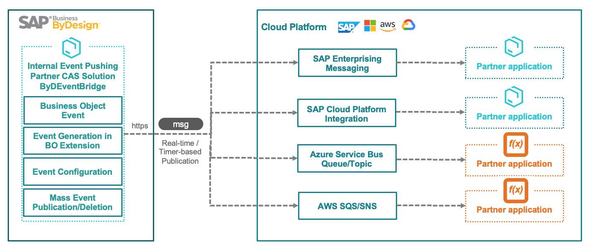
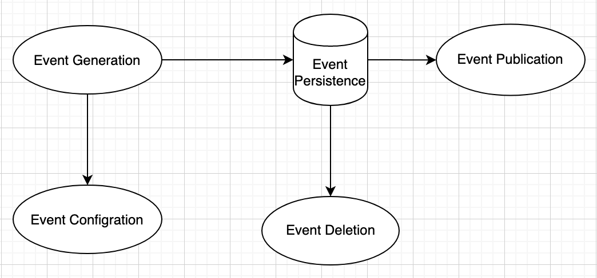
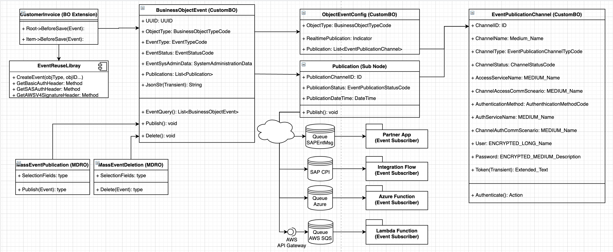

# Overview
A prototype built with SAP Cloud App Studio enables an event pub/sub mechanism for SAP Business ByDesign by plugging into modern cloud messaging services for side-by-side solution/extension development via an event-driven and loosely-coupled approach

# Architecure and Design
## High level architecture
Architecture:

Logical Components:

## Detail Design

# How-to guide
## Step 1: Create your own ByDEventBridge with Cloud Application Studio
The prototype ByDEventBridge is a customer-specific solution built with SAP Cloud Application on our internal tenant, therefore it is not possible to download the package, then directly import and deploy to another tenant. And the published source code only includes BODL and ABSL files, the wizard-based artifacts are exclusive due to the fact of their strict dependence with tooling and tenant, such as UI Screen, Query, Mass Data Run, External Service Integration, Communication Scenario and Communication Arrangement etc... which require to be created or configured with your own SAP Cloud Application on your own target ByD tenant.  

It is recommended to create a solution template including all reusable artifacts, such as BODL file, ABSL file and Reuse Library etc which are shared in this github, then you create customer specific solution by importing the solution template.

### [Event](src/ByDEventBridge/Event)
#### BusinessObjectEvent

### [Event Configuration](src/ByDEventBridge/EventConfig)
#### [EventPublicationChannel](src/ByDEventBridge/EventConfig/EventPublicationChannel)
#### [ObjectEventConfig](src/ByDEventBridge/EventConfig/ObjectEventConfig)

### [Event Source](src/ByDEventBridge/EventConfig/EventSource)

## Step 2: Setup your own Cloud Messaging Service

## Step 3: Configure EventPublicationChannel representing your Cloud Messaging Service

## Frequently Asked Questions:

### Adopting ByDEventBridge as a Customer Specific Solution or Solution Template or Multiple Customer Solution?
Answer: It is recommended to create a solution template including all reusable artifacts, such as BODL file, ABSL file and Reuse Library etc which are shared in this github, then you create customer specific solution by importing the solution template. In the long run, if you think it as a good solution which you would like to resell to multiple customers, then you can request approval to create a multi customer solution, and importing the solution template.  

### What are the best practice for event operation?
Answer: As rules of thumb 
* Only generate the event on the target node of the desired object. Filter the undesired event message as early as possible.
* Be very careful to generate the event for the very low-level foundation object such as BusinessPartner and Material etc. As BusinessPartner object is depended by Employee, Account, Supplier etc.
* If it doesn't require real-time, periodical Mass Event Publication is recommended to minimize the impact on your ByD tenant.
* To reduce the size of events, the completed or obsolete events should be periodically deleted by Mass Event Deletion(Mass Data Run Object).

### What cloud-based messaging service to use?
Answer: Although, the sample prototype is cloud-messaging-service-agnostic, supporting SAP Enterprise Messaging, SAP Cloud Platform Integration, Azure Service Bus and AWS SQS. In reality, most likely one type of cloud message service is enough.It is up to your company's strategy and client's preference to pick. If the client opt-in one vendor strategy, then SAP Enterprise Messaging or SAP Cloud Platform Integration is the right choice since they have already been a SAP customer for SAP Business ByDesign. for details, you may refer to the blog posts SCP Enterprise Messaging for the SMBs by my colleague Thiago Mendes, and SAP Cloud Platform Integration for SAP Business ByDesign webinar  by Maria Trinidad MARTINEZ GEA .

### When do you need event? What granularity of messaging queue or topic and partner solution as event subscriber?
Answer: The granularity of messaging queue or topic could be per partner solution/object type/source tenant or any combination, giving the flexibility of partner solution development and operation for addressing the variety of business and security etc requirements. For instance: 
* Case#1: Your company(SAP Partner) would like to develop and operate an eInvoicing solution as SaaS for multiple ByD customers, it is recommended to have one queue per client for the invoice object for the separation, and also due to the fact most cloud messaging service are charged by the number of messages, not by the number of queue.  For the eInvoicing app(event subscriber) which could be multi-tenant sharing among tenant, and you may need to design a mechanism when and how-to scale. If the eInvoicing app is implemented with serverless function, then it could be dynamically scaled up or down to accommodate the client requests with ease of mind. The pricing of your SaaS now could be easily calculated by the number of messages, and the process time of messages.  
* Case#2: Your ByD client A requests an integration of warehouse activities in ByD with their in-house Warehouse Management System. Of course, the requirement could be implemented with Cloud Application Studio, OData/Web Service of SAP ByD or SAP Cloud Platform Integration etc, which it doesn't need event and additional messaging service. However, with increase of the complexity of integration and the number of systems to be integrated, an event-driven architecture becomes approperiate. In this case, you may request the client to purchase an appropriate cloud messaging service, and you will help to bridge the event in SAP ByD and integration scenario development.